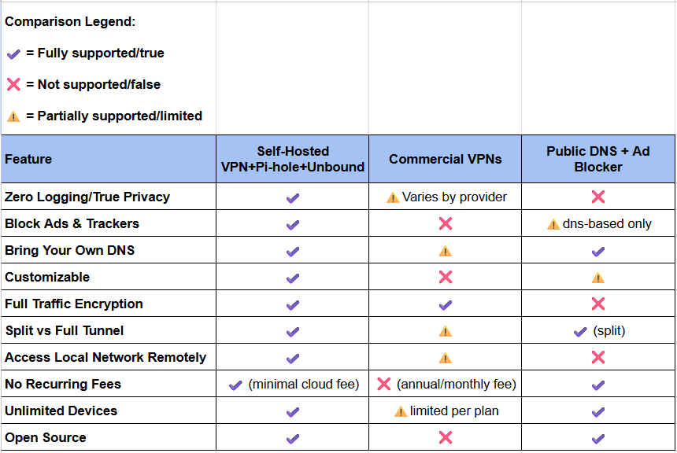
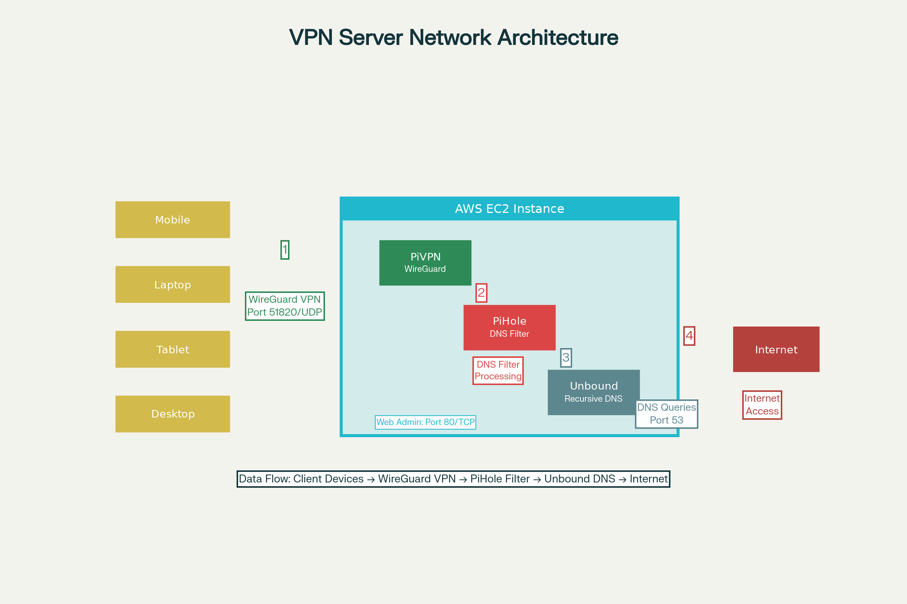

# Self-Hosted VPN Server with PiHole, PiVPN & Unbound on AWS EC2

[](https://opensource.org/licenses/MIT)
[](https://aws.amazon.com/ec2/)
[](https://pi-hole.net/)
[](https://www.wireguard.com/)

## 📋 Table of Contents
- [Problem Statement](#-problem-statement)
- [Solution Overview](#-solution-overview)
- [Features](#-features)
- [Architecture](#%EF%B8%8F-architecture)
- [Prerequisites](#-prerequisites)
- [Installation Guide](#-installation-guide)
- [Configuration](#%EF%B8%8F-configuration)
- [Usage](#-usage)
- [Monitoring & Maintenance](#-monitoring--maintenance)
- [Troubleshooting](#-troubleshooting)
- [Security Considerations](#-security-considerations)
- [Cost Analysis](#-cost-analysis)
- [Contributing](#-contributing)
- [License](#-license)

## 🚨 Problem Statement

### Current Internet Privacy & Security Challenges

The modern internet landscape presents significant privacy and security challenges for individual users:

#### **Quantitative Data:**
- **$44.6 billion** - Global VPN market size in 2023, projected to reach **$77.1 billion by 2030**
- **31%** of internet users rely on VPN services for privacy protection
- **3,205** data breaches occurred in 2023, with an average cost of **$4.45 million** per breach
- **68%** of users express concerns about commercial VPN providers logging their data
- **91%** of cyberattacks involve malicious DNS queries
- **25-30%** of web content consists of advertisements and trackers
- Average user generates **1,000-3,000 DNS queries per day**, revealing browsing patterns

See how this self-hosted solution stacks up against major commercial VPN options and typical public DNS with ad-blocker setups:



*Comparison between Self-Hosted VPN Server and Commercial VPN Services across key metrics*

### Key Problems:
1. **Commercial VPN Trust Issues**: Major VPN providers have been caught logging user data despite "no-logs" policies
2. **ISP Data Monetization**: Internet Service Providers legally sell browsing data in many countries
3. **DNS Privacy Violations**: Public DNS servers (Google, Cloudflare) can track and profile users
4. **Ad Tracking Epidemic**: Aggressive advertising networks compromise user privacy and consume bandwidth
5. **Centralized Dependencies**: Relying on third-party services creates single points of failure
6. **Limited Control**: Users have no control over logging policies, server locations, or data retention

## 💡 Solution Overview

This project provides a **self-hosted, privacy-first VPN solution** combining:

- **🛡️ PiHole**: Network-wide ad blocking and DNS filtering
- **🔒 PiVPN (WireGuard)**: Modern, fast VPN server implementation  
- **🌐 Unbound**: Recursive DNS resolver for enhanced privacy
- **☁️ AWS EC2**: Reliable, scalable cloud infrastructure

### Benefits:
- **100% Data Ownership**: No third-party logging or data collection
- **Custom DNS Control**: Block ads, malware, and tracking domains
- **Split & Full Tunneling**: Choose between DNS-only or complete traffic routing
- **Multi-Device Support**: Secure connections for phones, laptops, tablets
- **Remote Access**: Secure access to local networks from anywhere
- **Cost-Effective**: Runs on AWS free tier ($0-5/month)

## ✨ Features

### 🔒 Privacy & Security
- **Zero-Knowledge Architecture**: No logging of user activities
- **Encrypted DNS**: All DNS queries encrypted via DoH/DoT
- **WireGuard Protocol**: State-of-the-art VPN encryption
- **Custom Blocklists**: Block ads, trackers, malware, adult content

### 🌐 Network Features  
- **Split Tunneling**: Route only DNS through VPN (bandwidth efficient)
- **Full Tunneling**: Route all traffic through VPN (maximum privacy)
- **IPv4 & IPv6 Support**: Complete internet protocol coverage
- **Multiple Clients**: Support for unlimited device connections

### 📊 Monitoring & Management
- **PiHole Web Interface**: Real-time DNS query monitoring
- **Query Statistics**: Detailed analytics on blocked vs allowed requests  
- **Client Management**: Easy addition/removal of VPN clients
- **Performance Metrics**: Network latency and throughput monitoring

### 🛠️ Deployment Options
- **AWS EC2 Free Tier**: $0 monthly cost for light usage
- **Scalable Infrastructure**: Easy upgrade to paid tiers as needed
- **Global Regions**: Deploy in 25+ AWS regions worldwide
- **Elastic IP**: Consistent connection endpoint

## 🏗️ Architecture

Below is the high-level architecture for the self-hosted VPN server setup:



*Diagram: AWS EC2 instance running PiHole, PiVPN (WireGuard), and Unbound, serving multiple client devices securely via VPN.*

## 📋 Prerequisites

### AWS Account Requirements
- Active AWS account with billing information
- EC2 service access
- Understanding of AWS free tier limitations

### Technical Knowledge
- Basic Linux command line experience
- Understanding of networking concepts (IP addresses, ports, DNS)
- SSH client software

### Local Machine Requirements
- SSH client (Terminal on macOS/Linux, PuTTY on Windows)
- WireGuard client application
- Text editor for configuration files

## 🚀 Installation Guide

### Phase 1: AWS EC2 Setup

#### Step 1: Launch EC2 Instance
1. **Login to AWS Console** → Navigate to EC2 Dashboard
2. **Launch Instance** → Click "Launch Instance"
3. **Select AMI**: Ubuntu Server 22.04 LTS (Free tier eligible)
4. **Instance Type**: t2.micro (Free tier eligible)
5. **Key Pair**: Create new key pair named `vpn-server-key`
6. **Security Group**: Create new security group with rules:
   - SSH (22) from your IP
   - Custom UDP (51820) from anywhere (0.0.0.0/0)
   - HTTP (80) from your IP (for PiHole admin)
7. **Storage**: Default 8GB GP2 (free tier)
8. **Launch Instance**

#### Step 2: Configure Elastic IP
```bash
# In AWS Console
1. Navigate to EC2 → Elastic IPs
2. Allocate Elastic IP address
3. Associate with your VPN server instance
4. Note down the Elastic IP address
```

#### Step 3: Connect to Instance
```bash
# Set correct permissions for key file
chmod 600 ~/Downloads/vpn-server-key.pem

# Connect to instance
ssh -i ~/Downloads/vpn-server-key.pem ubuntu@YOUR_ELASTIC_IP
```

### Phase 2: System Preparation

#### Step 4: Update System
```bash
# Update package lists and upgrade system
sudo apt update && sudo apt upgrade -y

# Install essential packages
sudo apt install -y curl wget git ufw

# Configure firewall
sudo ufw allow ssh
sudo ufw allow 51820/udp
sudo ufw allow 80/tcp
sudo ufw --force enable
```

### Phase 3: PiHole Installation

#### Step 5: Install PiHole
```bash
# Download and run PiHole installer
curl -sSL https://install.pi-hole.net | bash

# Follow interactive installer:
# - Choose default network interface
# - Select upstream DNS (we'll change this later to Unbound)
# - Use default blocklists (can customize later)  
# - Install web admin interface
# - Install web server (lighttpd)
# - Log queries (recommended)
# - Set privacy level (show everything recommended for monitoring)
```

**Important**: Save the admin password displayed at the end of installation!

#### Step 6: Secure PiHole Admin Interface
```bash
# Change default admin password
pihole -a -p

# Configure PiHole to listen only on local interfaces
sudo nano /etc/pihole/setupVars.conf

# Add/modify these lines:
PIHOLE_INTERFACE=eth0
IPV4_ADDRESS=YOUR_PRIVATE_IP/24
PIHOLE_DNS_1=127.0.0.1#5335
PIHOLE_DNS_2=127.0.0.1#5335

# Restart PiHole
pihole restartdns
```

### Phase 4: Unbound Installation

#### Step 7: Install Unbound Recursive DNS
```bash
# Install Unbound
sudo apt install -y unbound

# Create Unbound configuration
sudo nano /etc/unbound/unbound.conf.d/pi-hole.conf
```

**Add the following configuration**:
```conf
server:
    # Listen on all interfaces, port 5335
    interface: 127.0.0.1
    port: 5335
    do-ip4: yes
    do-udp: yes
    do-tcp: yes

    # IPv6 support
    do-ip6: no
    prefer-ip6: no

    # Root hints
    root-hints: "/var/lib/unbound/root.hints"

    # Performance tuning
    num-threads: 4
    msg-cache-slabs: 8
    rrset-cache-slabs: 8
    infra-cache-slabs: 8
    key-cache-slabs: 8
    rrset-cache-size: 256m
    msg-cache-size: 128m
    so-rcvbuf: 1m

    # Privacy settings
    hide-identity: yes
    hide-version: yes
    harden-glue: yes
    harden-dnssec-stripped: yes
    harden-below-nxdomain: yes
    harden-referral-path: yes
    unwanted-reply-threshold: 10000000

    # Performance settings
    prefetch: yes
    prefetch-key: yes
    target-fetch-policy: "3 2 1 0 0"

    # Access control
    access-control: 127.0.0.1/32 allow
    access-control: 10.0.0.0/8 allow
    access-control: 172.16.0.0/12 allow
    access-control: 192.168.0.0/16 allow
```

#### Step 8: Configure Root Hints
```bash
# Download root hints
sudo wget -O /var/lib/unbound/root.hints https://www.internic.net/domain/named.cache

# Set permissions
sudo chown unbound:unbound /var/lib/unbound/root.hints

# Start and enable Unbound
sudo systemctl start unbound
sudo systemctl enable unbound

# Test Unbound
dig @127.0.0.1 -p 5335 google.com
```

### Phase 5: PiVPN Installation

#### Step 9: Install PiVPN
```bash
# Download and run PiVPN installer
curl -L https://install.pivpn.io | bash

# Installer options:
# - Choose WireGuard protocol
# - Default network interface (eth0)
# - Default port (51820)
# - Confirm public IP (your Elastic IP)
# - Default DNS (127.0.0.1 - will point to PiHole)
# - Choose desired DNS provider for fallback
# - Enable Unattended Upgrades
```

#### Step 10: Configure PiHole as DNS for PiVPN
```bash
# Edit PiVPN configuration
sudo nano /etc/pivpn/wireguard/setupVars.conf

# Ensure these settings:
DNS1=127.0.0.1
DNS2=1.1.1.1

# Restart PiVPN
sudo systemctl restart wg-quick@wg0
```

### Phase 6: VPN Client Configuration

#### Step 11: Create VPN Client Profiles
```bash
# Create client profile for phone
sudo pivpn add -n phone

# Create client profile for laptop  
sudo pivpn add -n laptop

# Create client profile for tablet
sudo pivpn add -n tablet

# List all clients
sudo pivpn list
```

#### Step 12: Configure Split Tunneling (DNS Only)
For bandwidth-efficient DNS-only routing:

```bash
# Edit client configuration for DNS-only tunnel
sudo nano /etc/wireguard/configs/phone.conf

# Modify AllowedIPs line:
# From: AllowedIPs = 0.0.0.0/0, ::/0
# To: AllowedIPs = 10.6.0.1/32

# Repeat for other client configs
sudo nano /etc/wireguard/configs/laptop.conf
sudo nano /etc/wireguard/configs/tablet.conf
```

#### Step 13: Configure Full Tunneling (All Traffic)
For maximum privacy with all traffic routed through VPN:

```bash
# Keep default AllowedIPs configuration:
AllowedIPs = 0.0.0.0/0, ::/0

# Note: This will consume more bandwidth
# Monitor AWS data transfer costs
```

## 📱 Client Setup

### Mobile Devices (iOS/Android)

#### Step 14: Generate QR Codes
```bash
# Display QR code for phone setup
sudo pivpn -qr phone

# Display QR code for tablet setup
sudo pivpn -qr tablet
```

1. Install WireGuard app from App Store/Play Store
2. Tap "+" → "Create from QR code"
3. Scan the QR code displayed in terminal
4. Name the tunnel (e.g., "Personal VPN")
5. Toggle connection to test

### Desktop/Laptop Setup

#### Step 15: Download Configuration Files
```bash
# From your local machine, download config files
scp -i ~/Downloads/vpn-server-key.pem ubuntu@YOUR_ELASTIC_IP:~/configs/laptop.conf ~/Downloads/

# For multiple files:
scp -i ~/Downloads/vpn-server-key.pem ubuntu@YOUR_ELASTIC_IP:~/configs/*.conf ~/Downloads/
```

#### Step 16: Install WireGuard Client
- **Windows**: Download from [WireGuard website](https://www.wireguard.com/install/)
- **macOS**: Install from App Store or Homebrew: `brew install wireguard-tools`
- **Linux**: `sudo apt install wireguard` (Ubuntu/Debian)

#### Step 17: Import Configuration
1. Open WireGuard client
2. Click "Import tunnel(s) from file"
3. Select downloaded .conf file
4. Activate tunnel

## 🎛️ Configuration

### PiHole Customization

#### Access PiHole Admin Interface
```
http://YOUR_ELASTIC_IP/admin
```

#### Custom Blocklists
Add additional blocklists for enhanced protection:
```
# Navigate to Group Management → Adlists
# Add these popular blocklists:

https://raw.githubusercontent.com/StevenBlack/hosts/master/hosts
https://someonewhocares.org/hosts/zero/hosts
https://raw.githubusercontent.com/AdguardTeam/AdguardFilters/master/BaseFilter/sections/adservers.txt
https://pgl.yoyo.org/adservers/serverlist.php?hostformat=hosts&showintro=0&mimetype=plaintext
```

#### Whitelist Management
```bash
# Whitelist domains via command line
pihole whitelist example.com

# Or use web interface:
# Navigate to Domains → Whitelist
```

### WireGuard Advanced Configuration

#### Custom DNS Settings
Edit client configurations for specific DNS behavior:
```conf
[Interface]
PrivateKey = CLIENT_PRIVATE_KEY
Address = 10.6.0.2/24
DNS = 10.6.0.1, 1.1.1.1

[Peer]
PublicKey = SERVER_PUBLIC_KEY
Endpoint = YOUR_ELASTIC_IP:51820
AllowedIPs = 0.0.0.0/0, ::/0
PersistentKeepalive = 25
```

#### Per-App Split Tunneling (Android)
Configure which apps use the VPN:
1. Open WireGuard app
2. Edit tunnel configuration
3. Tap "All applications" under "Excluded applications"
4. Select apps to exclude from VPN

## 📊 Usage

### Monitoring DNS Queries
- **Real-time Dashboard**: Access via PiHole admin interface
- **Query Log**: View all DNS requests and blocks
- **Statistics**: Monitor blocked percentage and top domains

### Managing VPN Clients
```bash
# List all clients
sudo pivpn list

# Add new client
sudo pivpn add -n newclient

# Remove client
sudo pivpn remove

# Generate QR code
sudo pivpn -qr clientname

# Show client statistics  
sudo pivpn -c
```

### Performance Optimization
```bash
# Monitor server resources
htop
df -h
free -m

# Check WireGuard status
sudo wg show

# View PiHole query volume
pihole -c -e
```

## 🔧 Monitoring & Maintenance

### Automated Updates
```bash
# Setup unattended upgrades
sudo nano /etc/apt/apt.conf.d/50unattended-upgrades

# Enable automatic security updates
sudo dpkg-reconfigure -plow unattended-upgrades
```

### Log Monitoring
```bash
# PiHole logs
tail -f /var/log/pihole.log

# WireGuard logs  
sudo journalctl -u wg-quick@wg0 -f

# System logs
sudo journalctl -f
```

### Backup Configuration
```bash
# Backup PiHole settings
pihole -a -t

# Backup WireGuard configs
sudo tar -czf wireguard-backup.tar.gz /etc/wireguard/

# Download backups to local machine
scp -i ~/Downloads/vpn-server-key.pem ubuntu@YOUR_ELASTIC_IP:~/wireguard-backup.tar.gz ~/Downloads/
```

### Health Checks
```bash
# Create health check script
sudo nano /usr/local/bin/vpn-health-check.sh
```

```bash
#!/bin/bash
# VPN Server Health Check Script

echo "=== VPN Server Health Check ==="
echo "Date: $(date)"
echo ""

# Check WireGuard status
echo "WireGuard Status:"
sudo wg show
echo ""

# Check PiHole status
echo "PiHole Status:"
pihole status
echo ""

# Check Unbound status
echo "Unbound Status:"
sudo systemctl is-active unbound
echo ""

# Check disk usage
echo "Disk Usage:"
df -h /
echo ""

# Check memory usage
echo "Memory Usage:"
free -h
echo ""

# Check network connectivity
echo "Network Connectivity:"
ping -c 3 google.com
```

```bash
# Make executable
sudo chmod +x /usr/local/bin/vpn-health-check.sh

# Run manually
sudo /usr/local/bin/vpn-health-check.sh

# Setup cron job for daily checks
echo "0 6 * * * /usr/local/bin/vpn-health-check.sh > /var/log/vpn-health.log 2>&1" | sudo crontab -
```

## 🔍 Troubleshooting

### Common Issues

#### DNS Resolution Problems
```bash
# Test DNS resolution
nslookup google.com 127.0.0.1

# Check PiHole DNS settings
cat /etc/pihole/setupVars.conf | grep DNS

# Restart DNS services
pihole restartdns
sudo systemctl restart unbound
```

#### VPN Connection Issues
```bash
# Check WireGuard configuration
sudo wg show all

# Verify firewall rules
sudo ufw status verbose

# Check if port 51820 is listening
sudo netstat -ulnp | grep 51820

# Test connectivity from outside
# From client machine:
telnet YOUR_ELASTIC_IP 51820
```

#### PiHole Not Blocking Ads
1. **Check DNS Settings**: Ensure clients use PiHole DNS (10.6.0.1)
2. **Update Blocklists**: Tools → Update Gravity
3. **Check Query Log**: Verify queries are reaching PiHole
4. **Whitelist Check**: Ensure desired domains aren't whitelisted

#### High Data Usage (AWS Charges)
```bash
# Monitor bandwidth usage
sudo apt install vnstat
vnstat -i eth0

# Check top data consumers
sudo netstat -i

# Consider split tunneling for high-usage clients
```

### Error Solutions

#### `/tmp/setupVars.conf permission denied`
```bash
sudo rm /tmp/setupVars.conf
# Re-run PiVPN installation
```

#### `Permission denied (publickey)` SSH Error
```bash
chmod 600 ~/Downloads/vpn-server-key.pem
ssh-add ~/Downloads/vpn-server-key.pem
```

#### WireGuard Not Starting
```bash
# Check configuration syntax
sudo wg-quick up wg0

# View detailed logs
sudo journalctl -u wg-quick@wg0 --no-pager

# Verify kernel module
lsmod | grep wireguard
```

## 🔐 Security Considerations

### Best Practices
1. **Regular Updates**: Keep all software updated
2. **Strong Passwords**: Use complex passwords for all accounts
3. **Key Rotation**: Periodically regenerate WireGuard keys
4. **Access Control**: Limit SSH access to specific IPs
5. **Monitoring**: Regularly review logs for suspicious activity

### Hardening Steps
```bash
# Disable root login
sudo nano /etc/ssh/sshd_config
# Set: PermitRootLogin no

# Enable fail2ban
sudo apt install fail2ban
sudo systemctl enable fail2ban

# Configure automatic security updates
sudo dpkg-reconfigure unattended-upgrades
```

### Network Security
- **Firewall Rules**: Only open necessary ports
- **Elastic IP**: Use consistent IP for better monitoring  
- **VPN Keys**: Store client configurations securely
- **Regular Audits**: Review connected clients monthly

## 💰 Cost Analysis

### AWS Free Tier Limits
- **750 hours/month** of t2.micro usage (sufficient for 24/7 operation)
- **30GB outbound data transfer** per month
- **1GB inbound data transfer** per month

### Estimated Monthly Costs

#### Free Tier Usage (First 12 Months)
| Component | Free Tier | Estimated Usage | Cost |
|-----------|-----------|-----------------|------|
| EC2 Instance | 750 hours | 744 hours | $0 |
| Outbound Data | 30GB | 10-25GB | $0 |
| Inbound Data | 1GB | <1GB | $0 |
| **Total** | | | **$0** |

#### Post Free Tier (After 12 Months)
| Component | Rate | Estimated Usage | Cost |
|-----------|------|-----------------|------|
| EC2 Instance | $0.0116/hour | 744 hours | $8.63 |
| Outbound Data | $0.09/GB | 25GB | $2.25 |
| Elastic IP | $0/month | 1 IP | $0 |
| **Total** | | | **$10.88** |

#### Comparison with Commercial VPN Services
| Service | Monthly Cost | Annual Cost | Privacy | Control |
|---------|-------------|-------------|---------|---------|
| Self-Hosted | $0-11 | $0-131 | ✅ Full | ✅ Complete |
| ExpressVPN | $12.95 | $155 | ❌ Limited | ❌ None |
| NordVPN | $11.95 | $143 | ❌ Limited | ❌ None |
| Surfshark | $12.95 | $155 | ❌ Limited | ❌ None |

### Cost Optimization Tips
1. **Monitor Usage**: Set up AWS billing alerts
2. **Split Tunneling**: Use DNS-only mode to reduce data transfer
3. **Regional Selection**: Choose nearest AWS region
4. **Scheduled Shutdown**: Turn off instance during unused periods (if applicable)

## 🤝 Contributing

We welcome contributions to improve this project! Here's how you can help:

### How to Contribute
1. **Fork** the repository
2. **Clone** your fork locally
3. **Create** a feature branch: `git checkout -b feature/improvement`
4. **Make** your changes and test thoroughly
5. **Commit** with clear messages: `git commit -m "Add feature: description"`
6. **Push** to your fork: `git push origin feature/improvement`  
7. **Submit** a Pull Request with detailed description

### Areas for Contribution
- 📖 **Documentation**: Improve setup guides, add troubleshooting tips
- 🐛 **Bug Fixes**: Fix issues with installation or configuration
- ✨ **Features**: Add monitoring scripts, automation tools
- 🧪 **Testing**: Test on different AWS regions, instance types
- 🎨 **UI/UX**: Improve PiHole dashboard customizations
- 🔧 **Scripts**: Create deployment automation, backup scripts

### Code Style Guidelines
- Use clear, descriptive variable names
- Comment complex configurations
- Follow existing file structure
- Test all changes on fresh EC2 instance

### Reporting Issues
When reporting bugs or requesting features:
1. **Search** existing issues first
2. **Provide** detailed reproduction steps
3. **Include** system information (OS, versions)
4. **Attach** relevant log files
5. **Suggest** potential solutions if possible

## 📄 License

This project is licensed under the MIT License - see the [LICENSE](LICENSE) file for details.

### Third-Party Licenses
- **PiHole**: European Union Public License v1.2
- **WireGuard**: GPLv2
- **Unbound**: BSD License

## 🙏 Acknowledgments

Special thanks to:
- **Pi-hole Team** - For creating an excellent DNS filtering solution
- **WireGuard Developers** - For the modern, efficient VPN protocol  
- **Unbound Team** - For the secure recursive DNS resolver
- **Original Guide Authors** - For the foundational setup instructions
- **Community Contributors** - For testing, feedback, and improvements

## 📞 Support

### Community Support
- **GitHub Issues**: Report bugs and request features
- **Discussions**: Ask questions and share experiences
- **Wiki**: Community-maintained documentation

### Professional Support
For enterprise deployments or custom configurations:
- Create detailed GitHub issue with "enterprise" label
- Include specific requirements and scale needs
- Response within 2-3 business days

---

**⚠️ Disclaimer**: This project is for educational and personal use. Users are responsible for compliance with local laws and AWS terms of service. Monitor your AWS usage to avoid unexpected charges.

**🔒 Privacy Notice**: This self-hosted solution provides maximum privacy, but users must properly configure and maintain their servers. Regular updates and security monitoring are essential.
